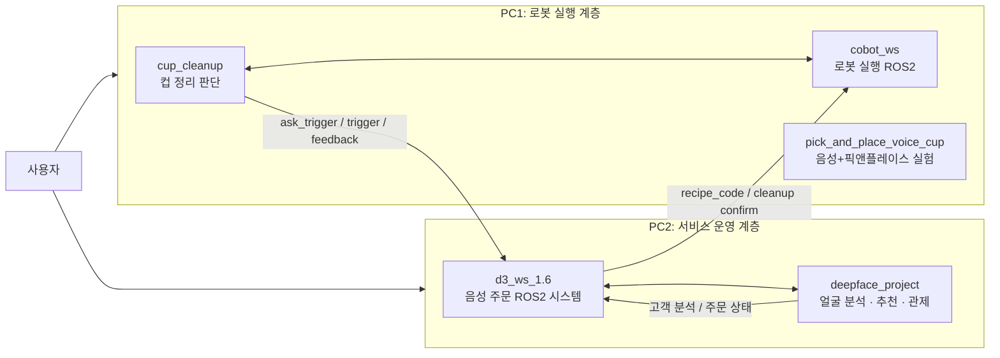
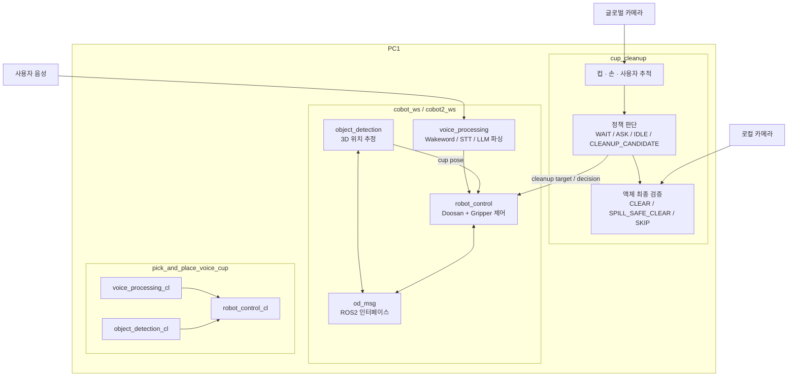
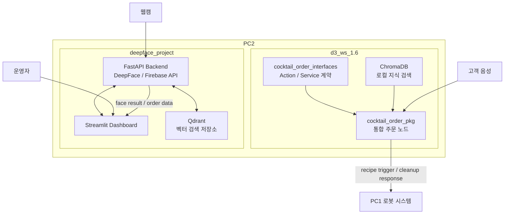
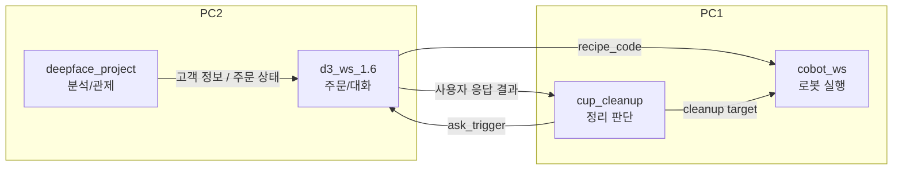

# D3 System Architecture

이 문서는 `D3` 워크스페이스의 전체 시스템 아키텍처를 설명합니다.

- `PC1`: 로봇 제어, 컵 정리, 물체 인식, 음성 입력 등 현장 실행 계층
- `PC2`: 음성 주문, 얼굴 분석, 추천/관제, 주문 상태 관리 등 서비스 운영 계층

## 전체 아키텍처

이 워크스페이스는 `PC1`과 `PC2`가 역할을 나눠 협력하는 분산 구조입니다.

- `PC1`은 로봇 제어와 현장 인지/실행을 담당합니다.
- `PC2`는 사용자 인터랙션, 주문 처리, 추천, 관제를 담당합니다.

이 관점에서 보면 `PC2`가 사용자 서비스 흐름을 만들고, `PC1`이 실제 물리 동작을 수행하는 구조입니다.

## PC1 아키텍처

`PC1`은 크게 세 레이어로 나눌 수 있습니다.

1. 인지 및 상태판단: `cup_cleanup`
2. 로봇 실행 및 ROS2 통합: `cobot_ws`
3. 별도 통합 실험 워크스페이스: `pick_and_place_voice_cup`

### PC1 핵심 흐름

1. `cup_cleanup`이 테이블 상태와 사용자 상호작용을 추적합니다.
2. 정리 가능성이 생기면 `ASK` 또는 `CLEANUP_CANDIDATE`를 결정합니다.
3. `cobot_ws`의 ROS2 노드가 대상 컵 위치를 추정하고 로봇 동작을 실행합니다.
4. 필요 시 음성 모듈이 컵/목적지 파싱이나 사용자 응답 처리에 참여합니다.

## PC2 아키텍처

`PC2`는 주문 처리와 운영 관제를 담당하는 서비스 계층입니다.

### PC2 핵심 흐름

1. `d3_ws_1.6`가 웨이크워드, STT, GPT, TTS를 이용해 주문 대화를 처리합니다.
2. 주문이 확정되면 레시피 코드나 컵 정리 응답을 ROS2 메시지로 발행합니다.
3. `deepface_project`는 얼굴 분석, 추천용 데이터 관리, 운영 대시보드를 담당합니다.
4. 운영자는 대시보드에서 고객 분석 결과와 주문 상태를 확인합니다.

## PC1 / PC2 연동 관점

실제 데모 기준으로 보면 두 PC의 연결은 다음 세 축으로 이해하면 됩니다.

- 주문 서빙 흐름: `PC2 -> PC1`
- 컵 정리 확인 흐름: `PC1 -> PC2 -> PC1`
- 운영 관제 흐름: `PC2` 내부에서 주로 처리