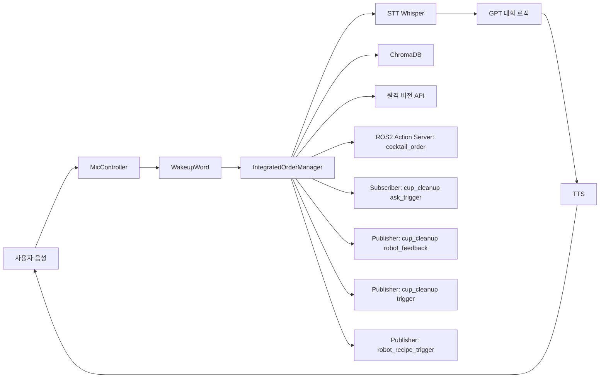

# 칵테일 주문 시스템 아키텍처 분석 보고서

작성일: 2026-05-28
대상 워크스페이스: d3_ws_1.6

## 1. 시스템 개요
이 프로젝트는 ROS 2 기반의 음성 주문 로봇 시스템이며, 다음 2개 패키지로 구성됩니다.

- cocktail_order_interfaces: 액션/서비스 인터페이스 정의
- cocktail_order_pkg: 실제 실행 노드 및 음성/AI/로봇 연동 로직

핵심은 통합 노드 1개가 주문 대화, 컵 정리 확인, 외부 비전/AI 연동, 레시피 트리거 발행까지 모두 담당하는 구조입니다.

## 2. 패키지 구조

### 2.1 인터페이스 계층 (cocktail_order_interfaces)
- Action: CocktailOrder.action
  - Goal: start_chat
  - Result: is_success, final_menu, recipe_code
  - Feedback: current_turn, user_text, bot_message
- Service: TriggerCleanup.srv
  - Request: cup_id
  - Response: success

역할:
- 런타임 노드 간 계약(메시지 형식)을 분리
- 실행 패키지와 인터페이스 패키지의 빌드/배포 책임 분리

### 2.2 애플리케이션 계층 (cocktail_order_pkg)
주요 모듈:
- integrated_order_node.py: 통합 오케스트레이션 노드
- MicController.py: 마이크 장치 선택, 스트림 제어
- wakeup_word.py: 웨이크워드 감지
- stt.py: OpenAI Whisper STT 연동
- tts.py: OpenAI TTS 연동
- build_db.py: ChromaDB 벡터 지식베이스 생성

엔트리포인트:
- order_node = integrated_order_node:main
- build_db = build_db:main

## 3. 런타임 아키텍처

## 4. 제어 흐름

### 4.1 주문 대화 흐름
1. IDLE 상태에서 웨이크워드 감지
2. run_dialogue_session 진입
3. 동적 녹음 -> STT 변환
4. GPT 상태 판정 (chat/recommend/confirm/success)
5. success 시 recipe_code 발행
6. IDLE 복귀

### 4.2 컵 정리 확인 흐름
1. cup_cleanup/ask_trigger 수신
2. 사용자에게 컵 정리 여부 TTS 질문
3. 음성 응답 STT 분석
4. 승인 시 cup_cleanup/trigger 발행
5. 거절/무응답 시 cup_cleanup/robot_feedback 발행

## 5. 아키텍처 장점
- 인터페이스 패키지와 실행 패키지 분리로 ROS2 기본 구조가 명확함
- 음성, 대화, 레시피 트리거, 컵 정리 이벤트를 하나의 비즈니스 흐름으로 통합
- MultiThreadedExecutor와 별도 웨이크워드 스레드로 실시간성 고려

## 6. 아키텍처 리스크
- 단일 노드 과집중 구조
  - 음성 I/O, 상태관리, GPT 호출, 비전 API, ROS 통신이 한 클래스에 밀집
- 상태 문자열 기반 동시성 제어
  - 트리거/대화 동시 유입 시 경합 가능성
- 환경 의존 하드코딩
  - 마이크 인덱스, 원격 API IP/포트 고정
- 분기 로직 중복 및 유지보수 난이도 증가
  - 레거시 함수와 신규 함수 공존

## 7. 개선 권장안 (우선순위)
1. 노드 분리
- DialogueNode, CleanupNode, PerceptionGatewayNode로 기능 분리

2. 상태머신 명시화
- enum + 전이표 기반으로 상태 전환 규칙 고정

3. 설정 외부화
- API 주소, 장치 인덱스, 임계값을 ROS 파라미터로 이동

4. 계약 단순화
- 컵 정리 기능을 서비스 또는 토픽 기반 중 하나로 일원화

## 8. 결론
현재 구조는 데모/통합 실험 단계에서 빠른 기능 검증에 유리한 통합형 아키텍처입니다. 다만 운영 안정성과 확장성을 위해서는 기능 분리, 상태머신 정교화, 설정 외부화가 반드시 필요합니다.
