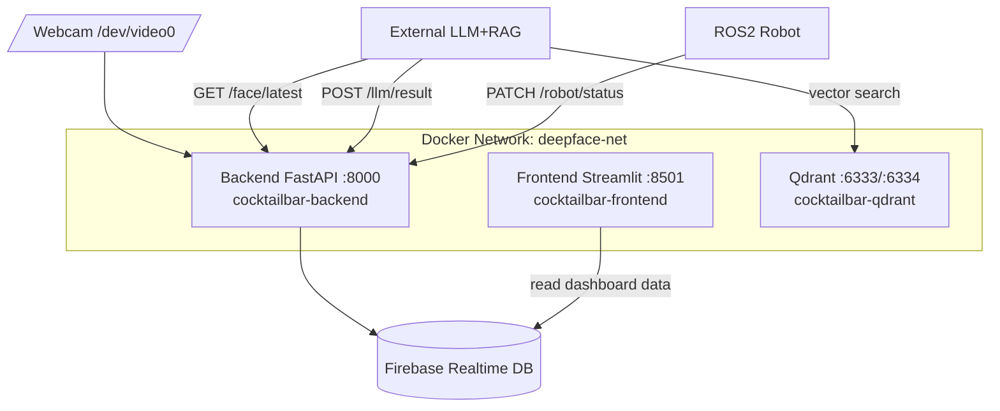

# AI Cocktail Bar

DeepFace 얼굴 분석, LLM+RAG 칵테일 추천, ROS2 서빙 로봇 연동을 통합한 운영 관제 프로젝트입니다.

## 1. 프로젝트 개요

이 시스템은 다음 흐름으로 동작합니다.

1. 웹캠으로 고객 얼굴 촬영
2. DeepFace로 나이/성별/감정 분석
3. 분석 결과를 Firebase Realtime DB에 저장
4. 외부 LLM+RAG 시스템이 고객 정보와 Qdrant 검색을 통해 칵테일 추천
5. 추천 결과를 주문으로 저장하고, ROS2 로봇이 서빙 상태를 업데이트
6. Streamlit 대시보드에서 전체 상황을 실시간 모니터링

## 2. 아키텍처



## 3. 서비스 구성

### Backend

- 기술: FastAPI, DeepFace, OpenCV, TensorFlow(GPU), Firebase Admin SDK
- 역할: 얼굴 분석 API, LLM 결과 수신, 로봇 상태 업데이트, Firebase 저장/조회
- 컨테이너: cocktailbar-backend
- 포트: 8000

### Frontend

- 기술: Streamlit, pandas, Firebase Admin SDK
- 역할: 운영 대시보드 (홈/고객분석/주문내역/통계/로봇현황)
- 컨테이너: cocktailbar-frontend
- 포트: 8501

### Qdrant

- 역할: 칵테일 임베딩 벡터 저장 및 유사도 검색
- 컨테이너: cocktailbar-qdrant
- 포트: 6333(REST), 6334(gRPC)

### Firebase Realtime DB

- face_results_raw: DeepFace 분석 원본 결과
- orders: LLM 추천 주문 및 로봇 상태

## 4. 기술 선택 이유

### Streamlit을 사용한 이유

- 이 프로젝트의 프론트는 일반 소비자용 UI가 아니라 운영자용 대시보드입니다.
- 홈, 고객분석, 주문내역, 통계, 로봇현황처럼 표와 지표 중심 화면이 많아서 Streamlit이 빠르게 맞습니다.
- pandas 데이터프레임, Firebase 조회 결과, 간단한 차트와 메트릭을 바로 연결하기 쉽습니다.
- 별도의 복잡한 프론트엔드 빌드 없이 Python만으로 빠르게 수정하고 배포할 수 있습니다.
- 자동 새로고침 기반의 실시간 모니터링 화면을 구현하기에 부담이 적습니다.

### FastAPI를 사용한 이유

- 얼굴 분석, LLM 결과 수신, 로봇 상태 업데이트처럼 API 중심 기능을 깔끔하게 분리할 수 있습니다.
- `/analyze/`, `/face/latest`, `/llm/result`, `/robot/status`, `/orders`처럼 역할이 명확한 엔드포인트 구성이 가능합니다.
- Swagger UI가 기본 제공되어 연동 테스트와 문서화가 쉽습니다.
- 비동기 엔드포인트와 Pydantic 스키마를 통해 요청/응답 구조를 명확하게 유지할 수 있습니다.

### DeepFace와 OpenCV를 사용한 이유

- 얼굴 인식 파이프라인의 핵심은 웹캠 실시간 입력과 얼굴 속성 분석입니다.
- OpenCV는 `/dev/video0` 기반 웹캠 캡처를 단순하게 처리할 수 있습니다.
- DeepFace는 나이, 성별, 감정 분석을 한 흐름으로 제공해서 이 프로젝트의 요구와 잘 맞습니다.
- 서버 내부에서 추론을 수행하므로 외부 영상 서비스에 의존하지 않고, 운영 흐름을 단순화할 수 있습니다.

### Qdrant를 사용한 이유

- 칵테일 추천은 단순 키워드 매칭보다 고객 정보에 맞는 후보 검색이 중요합니다.
- Qdrant는 임베딩 기반 유사도 검색에 적합해서 LLM+RAG 구조와 잘 맞습니다.
- 벡터 데이터와 검색 로직을 분리하면 추천 품질 개선과 데이터 확장이 쉽습니다.
- REST와 gRPC를 함께 제공해서 외부 시스템 연동에도 유리합니다.

### Firebase Realtime DB를 사용한 이유

- 얼굴 분석 결과와 주문 상태는 여러 컴포넌트가 동시에 읽고 쓰는 공용 데이터입니다.
- Realtime DB는 단순한 경로 구조로 저장/조회가 쉬워 대시보드와 백엔드가 함께 쓰기에 적합합니다.
- push key 기반 저장과 최신 데이터 조회 패턴이 이 프로젝트의 흐름과 잘 맞습니다.
- 운영 데이터가 실시간으로 반영되어야 하는 관제 화면에 사용하기 좋습니다.

### Docker Compose를 사용한 이유

- Backend, Frontend, Qdrant를 한 번에 묶어서 실행할 수 있습니다.
- 서비스 간 의존 관계를 명시할 수 있어서 대시보드가 백엔드보다 먼저 뜨는 문제를 줄입니다.
- GPU, 웹캠, 네트워크, 볼륨 마운트 같은 운영 요소를 코드처럼 관리할 수 있습니다.
- 같은 구성을 다른 환경으로 옮기기 쉽습니다.

### ROS2 연동을 분리한 이유

- 로봇 제어는 웹 API와 별도의 실시간 시스템이므로 책임을 분리하는 것이 안전합니다.
- 백엔드는 주문 상태만 관리하고, 실제 서빙 동작은 ROS2 쪽이 담당하는 구조가 유지보수에 유리합니다.
- 상태 업데이트를 API로만 연결하면 로봇 구현 변경이 있어도 백엔드 영향이 작습니다.

## 5. 주요 API

### GET /status
서버 상태와 웹캠 가용성 확인

### POST /analyze/
웹캠 촬영 -> DeepFace 분석 -> Firebase face_results_raw 저장

### GET /face/latest
가장 최근 얼굴 분석 결과 반환 (LLM 시스템용)

### POST /llm/result
LLM+RAG 추천 결과 수신 -> Firebase orders 저장

### PATCH /robot/status
주문의 로봇 처리 상태 갱신 (대기/처리중/완료/오류)

### GET /orders
저장된 주문 내역 전체 조회

## 6. 빠른 시작

### 6.1 사전 준비

- Docker, Docker Compose
- NVIDIA GPU 환경 사용 시 NVIDIA Container Toolkit
- Firebase 서비스 계정 키 파일

### 6.2 Firebase 키 배치

아래 위치에 키 파일을 준비합니다.

- backend/firebase/serviceAccountKey.json

중요: Frontend 컨테이너는 빌드 시 backend/firebase/serviceAccountKey.json 파일을 복사해서 사용합니다.
즉, 기본 구성에서는 위 경로 한 곳만 준비하면 Backend와 Frontend가 함께 사용합니다.

또는 환경변수로 경로를 오버라이드할 수 있습니다.

- FIREBASE_KEY_PATH
- FIREBASE_DATABASE_URL

### 6.3 환경변수 설정(선택)

.env.example를 참고해 .env를 구성할 수 있습니다.

주의: 현재 docker-compose.yml은 env_file 설정을 사용하지 않으므로,
.env 파일 값이 컨테이너 런타임 환경변수로 자동 주입되지는 않습니다.
런타임에 반영하려면 docker-compose.yml의 environment 또는 env_file에 명시해야 합니다.

예시:

```env
FIREBASE_KEY_PATH=./rokey-d3-firebase-adminsdk-fbsvc-4883ac5a98.json
FIREBASE_DATABASE_URL=https://YOUR_PROJECT_ID-default-rtdb.asia-southeast1.firebasedatabase.app/
CUDA_VISIBLE_DEVICES=-1
TF_CPP_MIN_LOG_LEVEL=2
```

### 6.4 실행

```bash
docker compose up --build
```

서비스 시작 순서:

1. qdrant
2. deepface-api
3. dashboard (deepface-api 헬스체크 통과 후)

### 6.5 접속

- Backend API: http://localhost:8000
- API 상태: http://localhost:8000/status
- Swagger UI: http://localhost:8000/docs
- Dashboard: http://localhost:8501
- Qdrant: http://localhost:6333

## 7. 디렉토리 구조

```text
deepface_project/
├── docker-compose.yml
├── ARCHITECTURE.md
├── README.md
├── backend/
│   ├── Dockerfile
│   ├── main.py
│   ├── requirements.txt
│   └── firebase/
│       ├── client.py
│       ├── config.py
│       ├── database.py
│       └── serviceAccountKey.json
├── frontend/
│   ├── dashboard.py
│   ├── Dockerfile
│   ├── requirements.txt
│   ├── pages/
│   │   ├── 1_Customer_Analysis.py
│   │   ├── 2_Cocktail_Orders.py
│   │   ├── 3_Statistics.py
│   │   └── 4_Robot_Dashboard.py
│   └── utils/
│       ├── data_loader.py
│       ├── firebase_init.py
│       └── styles.py
└── qdrant_data/
```

## 8. 운영 참고

- dashboard 서비스는 deepface-api healthcheck 통과 후 시작됩니다.
- backend는 qdrant 서비스에 의존합니다.
- 웹캠은 컨테이너에 /dev/video0으로 전달됩니다.
- GPU 환경이 아니면 CUDA_VISIBLE_DEVICES=-1 설정으로 CPU 모드 실행이 가능합니다.
- Backend Firebase 기본 키 경로: ./firebase/serviceAccountKey.json
- Frontend Firebase 기본 키 경로: ./serviceAccountKey.json

## 9. 트러블슈팅

- 증상: Firebase 인증 에러 (file not found)
  - 확인: backend/firebase/serviceAccountKey.json 파일 존재 여부
  - 확인: FIREBASE_KEY_PATH를 사용했다면 컨테이너 내부 경로 기준으로 유효한지

- 증상: 대시보드가 빈 데이터로 표시됨
  - 확인: Backend에서 /analyze/ 호출 후 face_results_raw 데이터 생성 여부
  - 확인: LLM 연동이 /llm/result를 호출해 orders 데이터가 쌓이는지

- 증상: 웹캠 인식 실패
  - 확인: 호스트에 /dev/video0 존재 여부
  - 확인: docker-compose.yml의 devices 매핑(/dev/video0:/dev/video0)

- 증상: GPU 초기화 실패
  - 확인: NVIDIA Container Toolkit 설치 여부
  - 대안: CPU 모드로 실행 (CUDA_VISIBLE_DEVICES=-1)

## 10. 문서 안내

- 상세 구조 및 API 예시는 ARCHITECTURE.md를 참고하세요.
