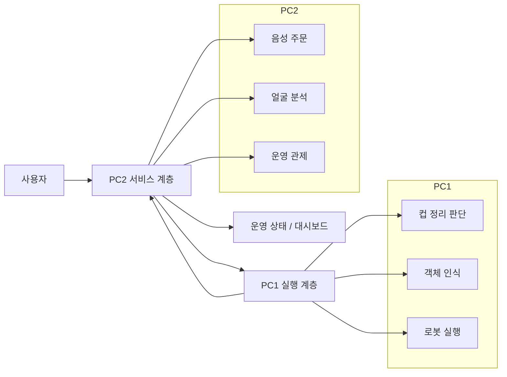
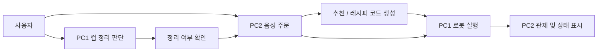

# Workspace Overview

이 저장소는 하나의 단일 애플리케이션이 아니라, `PC1`과 `PC2`에서 각각 독립적으로 운용되는 두 개의 시스템 묶음으로 구성되어 있습니다.

- `PC1`: 로봇 제어, 컵 정리, 물체 인식, 음성 입력 등 현장 실행 쪽 시스템
- `PC2`: 음성 주문, 얼굴 분석, 추천/관제, 주문 상태 관리 등 서비스/운영 쪽 시스템

상위 수준에서는 두 PC가 역할을 분담하는 구조로 보는 것이 가장 정확합니다.

## 👤 담당 역할

이 프로젝트는 5인 팀 프로젝트이며, 저는 `PC1` 영역의 **컵 인식 및 pick-and-place** 부분을 담당했습니다.

- `cobot_ws/src/cobot2_ws/object_detection` — RealSense + YOLO 기반 컵 위치 인식 및 3D 좌표 추정
- `cobot_ws/src/cobot2_ws/robot_control` — Doosan 로봇 + 그리퍼 제어, pick-and-place 실행

`cup_cleanup`(컵 정리 판단 정책), 음성 처리, `PC2`(음성 주문, 얼굴 분석, 운영 대시보드) 영역은 다른 팀원들이 담당했습니다.

## 🛠️ 트러블슈팅 (담당 파트: object_detection, robot_control)

- **카메라 FOV 문제로 인한 그리퍼 파지 위치 오차** — 엔드이펙터에 부착된 카메라의 시야각이 로봇팔 움직임에 따라 같이 변하는 구조라, 컵 위치 인식이 부정확해져 그리퍼가 컵을 너무 높은 지점에서 잡는 문제가 발생. 로봇팔 J6 회전으로 카메라가 컵을 정면으로 바라보도록 시야각을 조정해 해결
- **`minAreaRect` 기반 컵 방향 감지** — 그리퍼가 정확히 파지할 수 있도록 컵의 회전 방향까지 인식해야 했음. OpenCV `minAreaRect`로 탐지된 컵의 최소 외접 사각형을 구하고, 그 회전각을 그리퍼 접근 각도로 사용해 해결

## 통합 시스템 개요

이 프로젝트는 물리적으로는 `PC1`과 `PC2`로 분리되어 있지만, 데모와 운영 관점에서는 하나의 통합 서비스로 동작합니다.

- `PC2`가 사용자 인식, 음성 주문, 추천, 운영 관제를 담당합니다.
- `PC1`이 컵 상태 판단, 로봇 동작, 실제 pick-and-place 및 컵 정리를 담당합니다.
- 즉, `PC2`는 서비스 인터페이스 계층이고 `PC1`은 물리 실행 계층입니다.

통합 흐름은 아래처럼 이해하면 됩니다.

1. 사용자가 주문하거나 컵 정리 상황이 발생합니다.
2. `PC2`가 음성 주문, 얼굴 분석, 추천, 대시보드 표시를 담당합니다.
3. `PC1`이 컵 위치를 인식하고 로봇 동작을 수행합니다.
4. 컵 정리 상황에서는 `PC1`이 판단을 시작하고, 사용자 확인은 `PC2` 음성 인터페이스를 통해 처리합니다.
5. 최종 상태는 다시 `PC2` 대시보드나 주문 상태 정보로 반영됩니다.



## 전체 구조

```text
D3/
├── PC1/
│   ├── cobot_ws/
│   ├── cup_cleanup/
│   └── pick_and_place_voice_cup/
└── PC2/
    ├── d3_ws_1.6/
    └── deepface_project/
```

## 아키텍처 문서

전체 시스템 아키텍처는 별도 문서로 분리했습니다.

- [ARCHITECTURE.md](ARCHITECTURE.md): PC1 / PC2 전체 구조, 내부 구성, 연동 흐름

## 주요 기능

### PC1

- Doosan 로봇 기반 컵 pick-and-place 실행
- RealSense + YOLO 기반 컵 위치 인식 및 3D 좌표 추정
- 사용자 행동 기반 컵 정리 판단
- 로컬 카메라 기반 컵 내부 액체 최종 검증
- 음성 입력 기반 컵/목적지 파싱 및 정리 확인 응답 처리

### PC2

- 웨이크워드, STT, GPT, TTS 기반 음성 주문 처리
- 칵테일 추천용 벡터 DB 조회 및 레시피 코드 생성
- DeepFace 기반 나이/성별/감정 분석
- FastAPI 기반 외부 연동 API 제공
- Streamlit 기반 운영 대시보드 및 주문/로봇 상태 모니터링

## 시스템 설계 / 플로우 차트

- 전체 시스템 설계: [ARCHITECTURE.md](ARCHITECTURE.md)
- 서비스 계층 상세 아키텍처: [PC2/deepface_project/ARCHITECTURE.md](PC2/deepface_project/ARCHITECTURE.md)
- 컵 정리 동작 흐름: [PC1/cup_cleanup/README.md](PC1/cup_cleanup/README.md)

상위 수준 플로우는 아래처럼 볼 수 있습니다.



## 운영체제 환경

- 공통 권장 환경: Linux
- ROS2 워크스페이스: Ubuntu 22.04 계열 + ROS2 Humble 기준
- 서비스/관제 계층: Docker / Docker Compose 기반 Linux 환경
- GPU 사용 시: NVIDIA GPU + NVIDIA Container Toolkit 권장

## 사용 장비 목록

현재 문서와 코드 기준으로 확인되는 주요 장비는 아래와 같습니다.

- Doosan 협동로봇
  - `m0609` 사용 코드가 다수 존재
  - 일부 Doosan 예제는 `m1013` 기준 문서 포함
- OnRobot 그리퍼
  - `RG2` 중심 사용
- Intel RealSense 카메라
  - 컬러/깊이 토픽 기반 객체 인식 및 좌표 추정
- 로컬 카메라
  - 컵 내부 액체 검증용
- 마이크
  - 음성 주문, 웨이크워드, 정리 확인 응답 처리용
- 웹캠
  - DeepFace 얼굴 분석용 `/dev/video0`
- GPU 서버 또는 GPU 장착 PC
  - DeepFace / TensorFlow 가속용, 선택 사항

## 의존성

의존성은 프로젝트별로 분리되어 있습니다.

- PC1 컵 정리 Python 의존성: [PC1/cup_cleanup/requirements.txt](PC1/cup_cleanup/requirements.txt)
- PC2 주문 ROS2 패키지 Python 의존성: [PC2/d3_ws_1.6/src/cocktail_order_pkg/requirements.txt](PC2/d3_ws_1.6/src/cocktail_order_pkg/requirements.txt)
- PC2 얼굴 분석 Backend 의존성: [PC2/deepface_project/backend/requirements.txt](PC2/deepface_project/backend/requirements.txt)
- PC2 관제 Frontend 의존성: [PC2/deepface_project/frontend/requirements.txt](PC2/deepface_project/frontend/requirements.txt)

대표적으로 사용되는 라이브러리/스택은 아래와 같습니다.

- ROS2 `rclpy`, `ament_cmake`, `ament_python`
- OpenAI API, Whisper STT, TTS
- OpenCV, NumPy, SciPy
- Ultralytics YOLO
- Mediapipe, scikit-learn, pandas, matplotlib
- FastAPI, Streamlit, Firebase Admin SDK
- ChromaDB, Qdrant

## 실행 순서

전체 시스템을 데모 관점에서 실행할 때는 보통 아래 순서를 권장합니다.

### 1. PC1 로봇/인지 계층 준비

1. Doosan 로봇 또는 시뮬레이터 실행
2. RealSense 카메라 및 ROS2 카메라 토픽 확인
3. `PC1/cobot_ws` 워크스페이스 build 및 source
4. 객체 인식 노드 실행
5. 로봇 제어 노드 실행
6. 필요 시 음성 처리 노드 실행

### 2. PC1 컵 정리 정책 계층 준비

1. `PC1/cup_cleanup` 가상환경 활성화
2. `requirements.txt` 설치
3. 설정 파일 검토 (`configs/config.yaml`)
4. `main_demo.py`를 mock / debug / live-policy 모드 중 하나로 실행

### 3. PC2 주문 계층 준비

1. `PC2/d3_ws_1.6` 워크스페이스 build
2. `install/setup.bash` source
3. 필요 시 벡터 DB 생성
4. 주문 노드 실행

### 4. PC2 얼굴 분석/관제 계층 준비

1. Firebase 키 및 환경변수 준비
2. `PC2/deepface_project`에서 `docker compose up --build` 실행
3. Backend, Qdrant, Dashboard 정상 기동 확인

### 5. 통합 데모 실행 순서 요약

```text
Doosan/카메라 준비
-> PC1 ROS2 노드 실행
-> PC1 cup_cleanup 실행
-> PC2 주문 ROS2 실행
-> PC2 deepface_project 실행
-> 사용자 주문/정리 시나리오 테스트
```

### 6. 통합 운용 기준

- 주문 시나리오 중심이면 `PC2`를 먼저 확인하고, 최종 레시피 트리거가 `PC1` 로봇 실행으로 전달되는지 점검합니다.
- 컵 정리 시나리오 중심이면 `PC1`의 `cup_cleanup`과 로봇 제어 노드를 먼저 확인하고, 사용자 확인 음성이 `PC2` 주문 시스템으로 연결되는지 점검합니다.
- 발표나 제출 문서에서는 `PC1`과 `PC2`를 따로 나열하기보다, 먼저 통합 서비스 흐름을 설명한 뒤 세부 시스템을 분리해서 소개하는 편이 더 이해하기 쉽습니다.

세부 실행 명령은 아래 문서를 참고하는 것이 가장 정확합니다.

- [PC1/cup_cleanup/README.md](PC1/cup_cleanup/README.md)
- [PC2/d3_ws_1.6/READMD.md](PC2/d3_ws_1.6/READMD.md)
- [PC2/deepface_project/README.md](PC2/deepface_project/README.md)

## System A: PC1

`PC1`은 실제 로봇 동작과 근접한 실행 계층입니다. Doosan 로봇, ROS2 노드, 컵 탐지, 음성 입력, 컵 정리 정책, 실행 스킬이 이쪽에 모여 있습니다.

### 1. `cobot_ws`

Doosan 로봇과 ROS2 기반 실행 패키지를 담고 있는 메인 워크스페이스입니다.

- `src/doosan-robot2/`
  - Doosan ROS2 패키지 및 예제 모음
  - 시뮬레이션, visual servoing, realtime control, MuJoCo 예제 포함
- `src/cobot2_ws/object_detection/`
  - RealSense + YOLO 기반 객체 탐지와 3D 위치 추정
  - `get_3d_position` 서비스 제공
- `src/cobot2_ws/od_msg/`
  - 객체 위치 추정용 ROS2 서비스 인터페이스 정의
- `src/cobot2_ws/robot_control/`
  - Doosan 로봇과 그리퍼 제어
  - 레시피 트리거 또는 위치 서비스 결과를 받아 pick-and-place 수행
- `src/cobot2_ws/voice_processing/`
  - 마이크 입력, 웨이크워드, STT, LLM 기반 컵/목적지 파싱
- `src/cobot2_ws/rokey/`
  - 로봇 기본 제어 실습성 패키지

요약하면 `cobot_ws`는 "로봇이 실제로 움직이기 위한 ROS2 실행 환경"입니다.

### 2. `cup_cleanup`

사람-로봇 상호작용 기반 컵 정리 의사결정 프로젝트입니다.

- 글로벌 카메라로 컵, 손, 사용자 존재를 추적
- 상호작용 이력을 기반으로 `WAIT`, `ASK`, `IDLE`, `CLEANUP_CANDIDATE` 판단
- 로컬 카메라로 컵 내부 액체를 확인한 뒤 `CLEAR`, `SPILL_SAFE_CLEAR`, `SKIP` 결정
- 정책 학습, mock 데이터 생성, 실시간 추론, 데이터 수집 스크립트 포함

즉, `cup_cleanup`은 "언제 컵을 치워도 되는가"를 판단하는 인지/정책 레이어입니다.

### 3. `pick_and_place_voice_cup`

컵 탐지, 음성 명령, 로봇 pick-and-place를 하나의 ROS2 워크스페이스로 묶은 초기 또는 별도 통합 프로젝트입니다.

- `od_msg/`: 위치 서비스 인터페이스
- `pick_and_place_voice_cup/object_detection_cl/`: YOLO 기반 컵 탐지
- `pick_and_place_voice_cup/robot_control_cl/`: 로봇 및 그리퍼 제어
- `pick_and_place_voice_cup/voice_processing_cl/`: 웨이크워드/STT 기반 음성 처리

현재 구조상 `cobot_ws/src/cobot2_ws`와 역할이 일부 겹치므로, README에서는 "별도 통합 실험 워크스페이스"로 설명하는 편이 자연스럽습니다.

### PC1 한 줄 정리

`PC1`은 로봇 실행 중심 시스템이며, 크게

1. 로봇 ROS2 실행 환경 (`cobot_ws`)
2. 컵 정리 판단 로직 (`cup_cleanup`)
3. 음성+픽앤플레이스 통합 실험 워크스페이스 (`pick_and_place_voice_cup`)

로 나뉩니다.

## System B: PC2

`PC2`는 주문, 추천, 관제, 얼굴 분석, 외부 서비스 연동 쪽 시스템입니다. 현장 로봇을 직접 구동하기보다는 주문 흐름과 운영 대시보드에 더 가깝습니다.

### 1. `d3_ws_1.6`

ROS2 기반 음성 주문 시스템 워크스페이스입니다.

- `src/cocktail_order_interfaces/`
  - 주문 액션 및 컵 정리 확인 서비스 인터페이스 정의
- `src/cocktail_order_pkg/`
  - 통합 주문 노드
  - 웨이크워드, STT, TTS, GPT 대화 로직, 벡터 DB 조회 포함
- 주문 완료 시 레시피 코드를 발행하고, 컵 정리 ASK 트리거에도 응답

즉, `d3_ws_1.6`는 "음성 주문과 대화형 서비스 로직을 담당하는 ROS2 시스템"입니다.

### 2. `deepface_project`

운영 관제와 얼굴 분석, 추천 시스템 연동을 담당하는 Docker 기반 프로젝트입니다.

- `backend/`
  - FastAPI 기반 얼굴 분석 API
  - DeepFace + OpenCV + Firebase 연동
- `frontend/`
  - Streamlit 기반 운영 대시보드
  - 고객 분석, 주문 내역, 통계, 로봇 상태 표시
- `qdrant_data/`
  - 벡터 검색용 Qdrant 저장소
- `docker-compose.yml`
  - Backend, Frontend, Qdrant 통합 실행 구성

즉, `deepface_project`는 "얼굴 분석 + 추천 + 운영 대시보드"를 담당하는 서비스 계층입니다.

### PC2 한 줄 정리

`PC2`는 서비스 운영 중심 시스템이며, 크게

1. 음성 주문 ROS2 워크스페이스 (`d3_ws_1.6`)
2. 얼굴 분석/관제 웹 시스템 (`deepface_project`)

로 나뉩니다.

## PC1 / PC2 관계 정리

두 시스템은 같은 데모나 서비스 맥락을 공유하지만, 저장소 구조상 하나의 단일 코드베이스가 아니라 역할이 분리된 독립 시스템으로 보는 편이 맞습니다.

- `PC1`: 로봇이 보고, 판단하고, 집고, 치우는 쪽
- `PC2`: 사용자를 인식하고, 주문을 받고, 추천하고, 운영 상태를 보여주는 쪽

README를 작성할 때도 이 둘을 하나로 뭉뚱그리기보다, 먼저 `PC1`과 `PC2`를 분리 설명한 뒤 하위 프로젝트를 소개하는 구조가 가장 읽기 쉽습니다.

## 권장 README 작성 순서

통합 README를 더 확장하려면 아래 순서로 설명하는 것을 권장합니다.

1. `PC1`과 `PC2`가 독립 시스템이라는 점을 먼저 명시
2. 각 PC의 핵심 목적을 1문단으로 요약
3. 각 PC 아래의 하위 프로젝트를 2~4개 정도로 나눠 설명
4. 세부 실행 방법은 각 하위 프로젝트 README로 링크

## 참고 문서

- `PC1/cup_cleanup/README.md`: 컵 정리 판단 로직과 실행 방법
- `PC1/pick_and_place_voice_cup/src/README.md`: 음성 기반 pick-and-place 워크스페이스 설명
- `PC1/cobot_ws/src/doosan-robot2/README.md`: Doosan ROS2 패키지
- `PC2/d3_ws_1.6/READMD.md`: 음성 주문 ROS2 시스템 개요
- `PC2/deepface_project/README.md`: 얼굴 분석/관제 시스템 개요
- `PC2/deepface_project/ARCHITECTURE.md`: 서비스 아키텍처 상세
